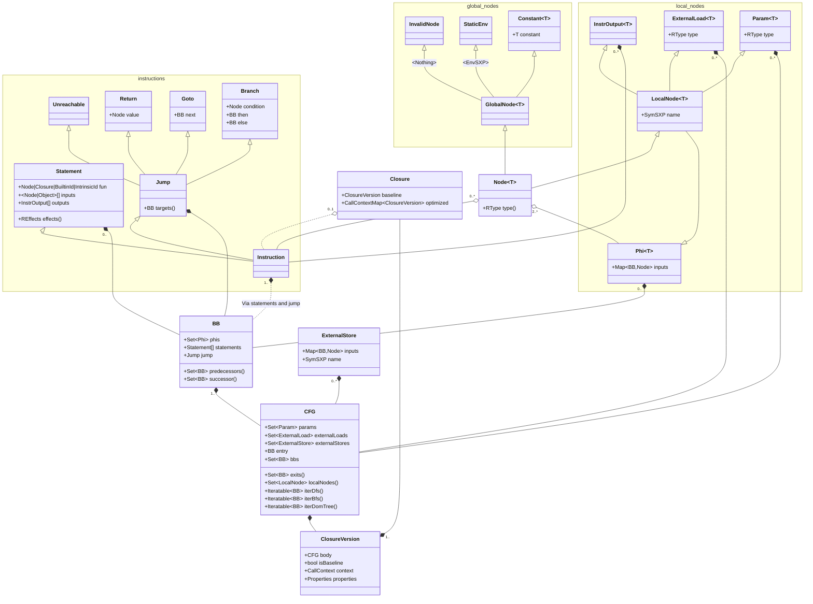
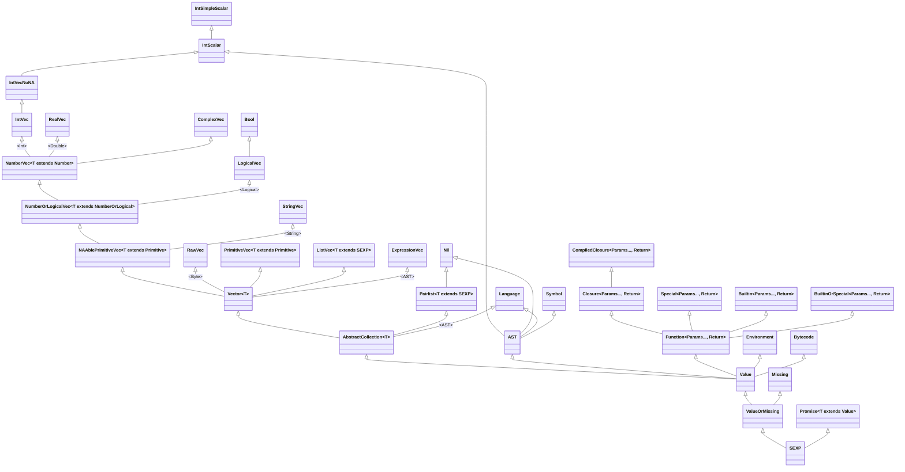

# RIR^2^ IR specification

## Abstract

An SSA-based IR with R-specific details:

- **R type hierarchy** (value/promise, missing/not-missing, `SEXPTYPE`, `"class"` attribute, "is scalar", "is maybe NA").
- **Ownership annotations and alias tracking** for some in-place mutation beyond R's reference counting (`@borrows` and `@mutates` parameter attributes, `@fresh` return attribute).
- Limited notion of **effects**, to control reordering.
- Signatures for R's builtins and hard-coded library functions, ability to add manual signatures for third-party libraries.
- **Multiple call types:** GNU-R calls (must wrap args in promises at least sometimes, then wrap in `ListSXP` and provide an environment), compiled closure (can pass args without allocating a `ListSXP`, share environment stored in a static variable if it's faster), and compiled closure version (skips compiled closure dispatch and directly calls the optimized version).

May also use e-graphs like [Cranelift's "aegraphs"](https://github.com/bytecodealliance/rfcs/blob/main/accepted/cranelift-egraph.md), but that would be for later.

## Formal specification

### Organization

#### Code

- `Closure` is a compiled closure. It contains a baseline version with feedback, and zero or more optimized versions with optimized code.
- `ClosureVersion` is a specific version of the closure's body, either "baseline" (unoptimized) or optimized.
- `CFG` is the control-flow-graph, `BB` are basic blocks, `Phi` are phi nodes.
  - Unlike some `CFG`s, `Phi`s are required and guaranteed to have an input corresponding to every one of their origin block's predecessors. If a block gets a new predecessor, its `Phi`s automatically gain a new input from that predecessor with an "unset stub" node; if a block loses a predecessor, its `Phi`s automatically lose the corresponding input.
- `Param` is a function parameter. `ExternalLoad` is a variable that gets loaded and "safe forced" from the environment before an optimized closure is called, then passed to the closure similar to a parameter (baseline closures have no `ExternalLoad`s or `ExternalStore`s, instead they have "external load" and "external store" instructions).
- `ExternalStore` is an operation that runs at every exit from the control-flow-graph, and stores an externally-loaded variable that could have been mutated (essentially a `Phi` from every exit block, followed by "external store" instruction). `ExternalLoad` and `ExternalStore` together allow optimized closures to convert variables loaded from and super-assigned into the outside environment into locals; the local is loaded once from the outside environment at the beginning of the instruction, its type is part of the `CallContext` like a parameter, then if an optimized version runs, it gets stored once at the end of the optimized code.
- `Statement` is an abstract runtime operation. It has a:
  - **Function,** which may be a `Node` (GNU-R closure call), `Closure` (compiled closure call), `BuiltinId` (GNU-R builtin call) or `IntrinsicId` (e.g. "external load", "make closure").
  - List of **inputs** whose size and required types (class types and `RType`s) depend on the function. For example, "make closure" has a single input that is a `Closure`; GNU-R binary operation builtins have two inputs that are `Node`s, although the type of node may be arbitrary (`Node<?>`); GNU-R closure calls have at least one input that is a list of `String`s (argument names), followed by variable number of `Node<?>` inputs.
  - List of **outputs** (local nodes) whose size depends on the function, and whose `RType` depends on the function and input `RType`.
  - Additionally, instructions store a cached set of **effects** (`REffect`), that are computed from the function and input `RType`s.
- `Node` is an abstract runtime value that is an input to an instruction or phi. `LocalNode` is a node that belongs to a particular control-flow-graph, while `GlobalNode` is a node like a `Constant` that can be reused across graphs.
  - `InvalidNode` is a stub, e.g. for an unset phi input, or to maintain the structure after an internal compiler error.

Other:

- `CallContext` is a set of assumptions that must be met for an optimized version to dispatch `CallContextMap` lets you get the "best" version given a specific set of assumptions.
  - The call context may also imply a set of "guards" that translate to code at runtime; if a context *could* match, its guard code is run to determine whether it *does* match, otherwise the next most-specific context is chosen and that guard may be "penalized" so it instantly fails the next $n$ times, to reduce the execution time wasted.
- `Properties` is the set of assumptions you get if a `ClosureVersion` is executed (postconditions). These are used when the version is statically called by another optimized closure, e.g. to reorder or redundant-merge if a property is no side-effects.
- `RType` is an abstract runtime type (TODO: `SEXP` and `RType` class graph)

Clarification:

- Instructions can have non-node inputs if they are required to be statically known. For example, an "make closure" instruction has a statically-known closure, so that input is `Closure`, not `Node<Closure>`. `Constant` nodes are inputs that just happen to be static but in general aren't required to be. For example, `Phi`'s inputs are all `Node`s because, specific phis may have static inputs from some or all predecessors, but this isn't true for phis in general.

#### Types

