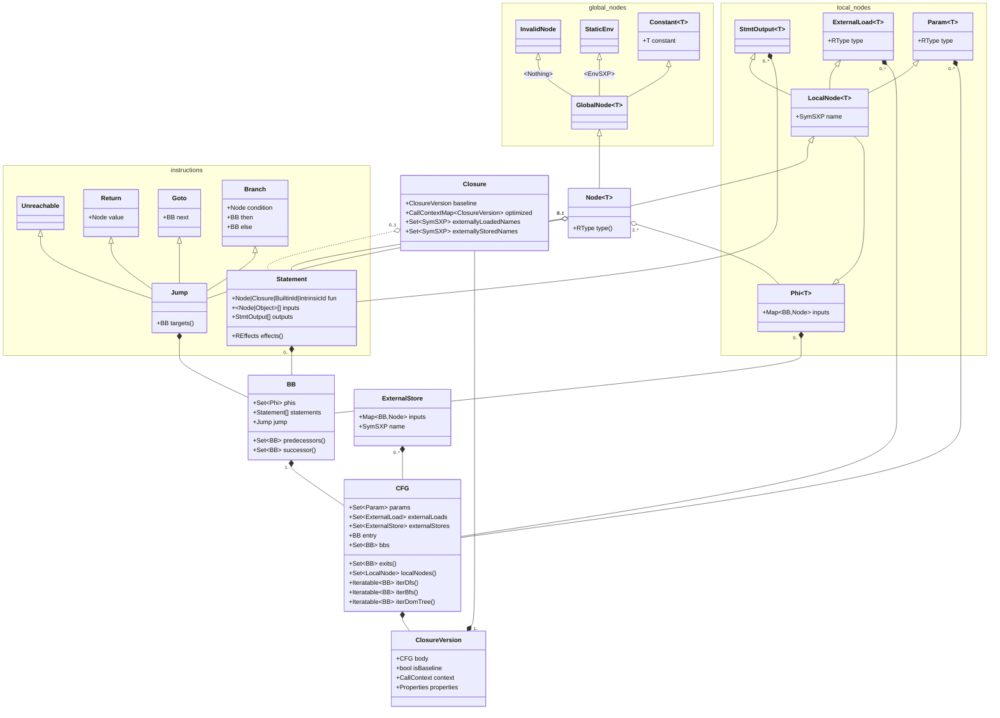
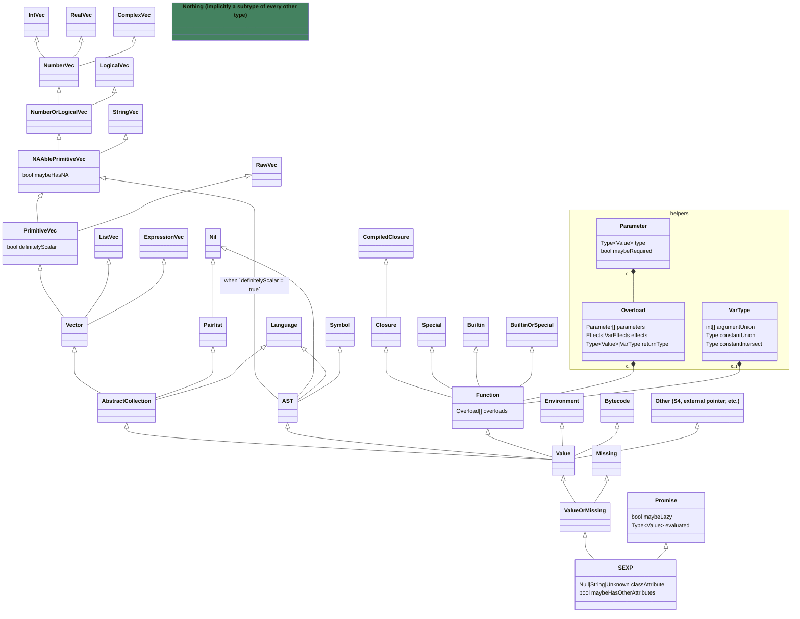

# RIR^2^ IR specification

## Abstract

An SSA-based IR with R-specific details:

- **R type hierarchy** (value/promise, missing/not-missing, `SEXPTYPE`, `"class"` attribute, "is scalar", "is maybe NA").
- **Ownership annotations and alias tracking** for some in-place mutation beyond R's reference counting (`@borrows` and `@mutates` parameter attributes, `@fresh` return attribute).
- Limited notion of **effects**, to control reordering.
- Signatures for R's builtins and hard-coded library functions, ability to add manual signatures for third-party libraries.
- **Multiple call types:** GNU-R calls (must wrap args in promises at least sometimes, then wrap in `ListSXP` and provide an environment), compiled closure (can pass args without allocating a `ListSXP`, share environment stored in a static variable if it's faster), and compiled closure version (skips compiled closure dispatch and directly calls the optimized version).

May also use e-graphs like [Cranelift's "aegraphs"](https://github.com/bytecodealliance/rfcs/blob/main/accepted/cranelift-egraph.md), but that would be for later.

## Formal specification

### Organization

#### Code



- `Closure` is a compiled closure. It contains a baseline version with feedback, and zero or more optimized versions with optimized code.
  - It also contains externally-loaded and stored (super-assigned) variables, so that when we "safe force" promise arguments, we don't load a variable that could be stored before the promise actually would've been evaluated.
- `ClosureVersion` is a specific version of the closure's body, either "baseline" (unoptimized) or optimized.
- `CFG` is the control-flow-graph, `BB` is a basic block, `Phi` is a phi node.
  - Unlike some `CFG`s, `Phi`s are required and guaranteed to have an input corresponding to every one of their origin block's predecessors. If a block gets a new predecessor, its `Phi`s automatically gain a new input from that predecessor with an "unset stub" `InvalidNode`; if a block loses a predecessor, its `Phi`s automatically lose the corresponding input.
- `Param` is a function parameter. `ExternalLoad` is a variable that gets loaded and "safe forced" from the environment before an optimized closure is called, then passed to the closure (so it's similar to a parameter. Also, baseline closures have no `ExternalLoad`s or `ExternalStore`s, instead they have "external load" and "external store" instructions).
  - `Param` and `ExternalLoad` are in versions, not the closure itself, because different versions may dispatch on different types of parameters and externally-loaded variables. `ExternalStore` is in versions because the input nodes are different for different versions.
- `ExternalStore` is an operation that runs at every exit from the control-flow-graph, and stores a variable that is possibly super-assigned (essentially a `Phi` from every exit block, followed by "external store" instruction). `ExternalLoad` and `ExternalStore` together allow optimized closures to convert variables loaded from and super-assigned into the outside environment into locals, so optimized closures don't have explicit "load" and "store" instructions; externally-loaded variables are loaded once from the outside environment at the beginning of the closure dispatch, their computed types are matched against `CallContext`es like parameters, then if an optimized version runs, they get stored in locals; and super-assigned variables in optimized versions get assigned to locals, and only gets stored into the outside environment at the end of the optimized code.
- `Statement` is an abstract runtime operation. It has a:
  - **Function,** which may be a `Node` (GNU-R closure call), `Closure` (compiled closure call), `BuiltinId` (GNU-R builtin call) or `IntrinsicId` (e.g. "external load", "make closure").
  - List of **inputs** whose size and required types (class types and `RType`s) depend on the function. For example, "make closure" has a single input that is a `Closure`; GNU-R binary operation builtins have two inputs that are `Node`s, although the type of node may be arbitrary (`Node<?>`); GNU-R closure calls have at least one input that is a list of `String`s (argument names), followed by variable number of `Node<?>` inputs.
  - List of **outputs** (local nodes) whose size depends on the function, and whose `RType` depends on the function and input `RType`.
  - Additionally, instructions store a cached set of **effects** (`REffect`), that are computed from the function and input `RType`s.
- `Node` is an abstract runtime value that is an input to an instruction or phi. `LocalNode` is a node that belongs to a particular control-flow-graph, while `GlobalNode` is a node like a `Constant` that can be reused across graphs.
  - `InvalidNode` is a stub, e.g. for an unset phi input, or to maintain the structure after an internal compiler error.

Other:

- `CallContext` is a set of assumptions that must be met for an optimized version to dispatch `CallContextMap` lets you get the "best" version given a specific set of assumptions.
  - The call context may also imply a set of "guards" that translate to code at runtime; if a context *could* match, its guard code is run to determine whether it *does* match, otherwise the next most-specific context is chosen and that guard may be "penalized" so it instantly fails the next $n$ times, to reduce the execution time wasted.
- `Properties` is the set of assumptions you get if a `ClosureVersion` is executed (postconditions). These are used when the version is statically called by another optimized closure, e.g. to reorder or redundant-merge if a property is no side-effects.
- `RType` is an abstract runtime type (see [#types](#types)).

Clarification:

- Instructions have non-node inputs if they are required to be statically known. For example, a "make closure" instruction has a statically-known closure, so that input is `Closure`, not `Node<Closure>`. `Constant` nodes are inputs that just happen to be static but in general aren't required to be. For example, `Phi`'s inputs are all `Node`s because, specific phis may have static inputs from some or all predecessors, but this isn't true for phis in general.

#### Types



The "fields" in the above diagram are essentially generic type parameters, implicit on the subtypes: e.g. a type isn't just  `StringVec`, but `StringVec<isScalar = false, maybeHasNA = false, classAttribute = "foo", maybeHasOtherAttributes = false>`. The type parameters have their own subtype relations, so the prior example is not a subtype of a `PrimitiveVec<isScalar = true, ...>` or `PrimitiveVec<..., classAttribute = "bar", ...>`, but is a subtype of `PrimitiveVec<isScalar = false, maybeHasNA = true, classAttribute = unknown, maybeHasOtherAttributes = true>` (or `Value<classAttribute = "foo", maybeHasOtherAttributes = false>`, or `StringVec<isScalar = false, maybeHasNA = true, classAttribute = "foo", maybeHasOtherAttributes = true>`, etc.).

`VarType` allows a function's return type to be the union of one or more argument types and a constant type (which may be `Nothing`), intersected with another constant type (which may be `SEXP`). `VarEffects` will work similarly for the effects in other arguments that are closures (TODO the effect system). Additionally, since R isn't strongly typed, any function may be given arguments besides the ones in any of its overloads; in that case, the type system will specify it returns anything and has any effects.

The class hierarchy of `SEXP` and `RType` are the same (for instance we have an "integer scalar SEXP" and an "integer scalar type", etc.)

### Syntax

#### Code

TODO

Examples:

```r
function @missingArgs(args) {
  baseline {
      val <- logical(length(args))
      for (i in seq_along(args)) {
          a <- args[[i]]
          if (missing(a))
              val[i] <- TRUE
          else
              val[i] <- FALSE
      }
      val
  }
  optimized(args:sym|miss[]@borrow) ->{error} lgl[]@fresh {
      _1:whole = length(args)
      val:bool[]@fresh = logical(_1)
      _forLast:whole <- length(val)
      i:nat = 0L
      goto ^forStep
    ^forStep(i.1(i:^entry, i.2:^forBody), val.1(val:^entry, val.2:^forBody)):
      i.2:whole = `+`(i.1, 1L)
      _breakFor:bool <- `<`(_forLast, i.2)
      if _breakFor goto ^forExit else ^forBody
    ^forExit:
      return val.1
    ^forBody:
      a:sym|miss <- `[[`(args, i.2)  {error}
      _2:bool <- missing(a)
      val.2:bool[]@fresh <- `[`(val.1, i.2, _2)   {@mutates val.1}
      goto ^forStep
  }
}
```

#### Types

- `Nothing` = `_`
- `IntVec` = `int`
- `RealVec` = `real`
- `ComplexVec` = `cplx`
- `NumberVec` = `num`
- `LogicalVec` = `bool`
- `NumberOrLogicalVec` = `num|bool`
- `StringVec` = `str`
- `NAAblePrimitiveVec` = `nprim`
  - Iff `maybeHasNA` is `true`, append `|na` (e.g. `int|na`)
- `PrimitiveVec` = `prim`
  - If `definitelyScalar` is `false`, append `[]` (e.g. `str[]`, `bool|na[]`)
- `ListVec` = `list`
  - If `element` is not `Value`, the type is `list(<element>)` (e.g. `list(expr)` for a list of expression vectors).
- `ExpressionVec` = `expr`
- `Vector` = `vec`
- `Nil` = `nil`
- `PairList` = `pair`
- `Language` = `lang`
- `AbstractCollection` = `coll`
- `Symbol` = `sym`
- `AST` = `ast`
- `CompiledClosure` = `cclo`
- `Closure` = `clo`
- `Builtin` = `blt`
- `Special` = `spec`
- `BuiltinOrSpecial` = `blt|spec`
- `Function` = `fun`
  - Overloads, parameters, and the return type are represented like such: `clo{(int[], real|na?) -> bool}` is a closure that takes a required non-NA integer vector, optional maybe-NA real scalar, and returns a non-NA logical scalar (boolean). `blt{(sym) ->{error} bool, (str) ->{error} bool}` is a builtin that takes a symbol or string and returns a boolean, and may error in either case (or, as mentioned above, both functions can take other arguments, return arbitrary values, and have any effects). `fun{(prim[]@attrs) -> 1&prim@attrs}` is a function (not specified whether closure or builtin) that takes a primitive vector that may have attributes, and returns a vector of the same type except scalar.
- `Environment` = `env`
- `Bytecode` = `bcode`
- `Other` = `other`
- `Value` = `val`
- `Missing` = `miss`
- `ValueOrMissing` = `val|miss`
- `Promise` = `prom` if evaluated, `lazy` if lazy.
  - Maybe-laziness and the evaluated type are represented as such: `prom(bool)` is a strict promise containing a boolean, `lazy(int[])` is a maybe-lazy promise that produces an integer vector.
- `SEXP` = `any`
  - If `classAttribute` is a string (e.g. `foo`), the type has the suffix `@"foo"`. If `classAttribute` is unknown and `maybeHasOtherAttributes` is `false`, the type has suffix `@class`. If `maybeHasOtherAttributes` is `true`, the type has the suffix `@attrs`: if it has no class, `@noclass@attrs`, if it has a specific class (e.g. `foo`), `@"foo"@attr`, and if it has an unknown class, `@attrs`.

Examples:

- Integer simple scalar (no attributes, no NA, etc.): `int`.
- Same but maybe NA: `int|na`.
- Same but vector: `int|na[]`.
- Same but has the class "foo": `int|na[]@"foo"`.
- Same but maybe has other attributes: `int|na[]@"foo"@attr`.
- Function that takes two vectors of any type, with any attributes, and returns a vector of the union of their types: `fun{(vec[]@attrs, vec[]@attrs) -> 1|2}`.
- List of attribute-less integer vectors that may itself have attributes: `list(int[])@attrs`.
